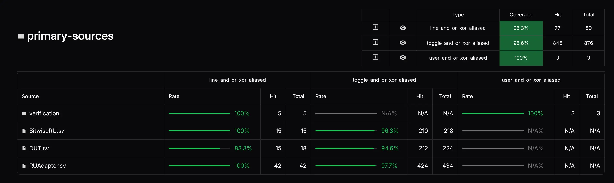

# Verilator Coverage Conversion Script for Coverview Visualization




Converts one or more [Verilator](https://www.veripool.org/verilator/) `coverage.dat` files into a [Coverview](https://github.com/antmicro/coverview)-ready `.zip` package for visualization.

It supports:
- merging multiple test runs,
- line/toggle/user coverage extraction,
- source path aliasing across equivalent test directories,
- excluding selected source files from coverage,
- loading arguments from YAML.

## Requirements

The script requires these tools in `PATH`:
- `verilator_coverage` (from [verilator](https://verilator.org/), tested on `Verilator 5.040 2025-08-30 rev v5.040`)
- `info-process` (tested on [info-process@4c661cd](https://github.com/antmicro/info-process/commit/4c661cd6cb18df8ecfab7118cc0acbf4218b302a))

Python: `3.10+` (uses modern type hints)
- Use `uv` to manage environment and Python dependencies in this repo.
- Run `uv sync` once before first use.

Coverview: tested on [coverview@15386d3](https://github.com/antmicro/coverview/commit/15386d3b85712ab69e3a34cbc8a1ddd579cb14ad)

## Quick Start

Run in a directory that contains `coverage.dat`:

```bash
uv run ./convert_coverage_to_coverview.py coverage.dat
```

Merge three runs:

```bash
uv run ./convert_coverage_to_coverview.py \
  and/coverage.dat \
  or/coverage.dat \
  xor/coverage.dat \
  --dataset and_or_xor
```

Import the generated `coverview_data_<dataset>.zip` into Coverview.

## Command-Line Interface

```text
usage: convert_coverage_to_coverview.py [-h] [--args-yaml FILE] [-d DATASET]
                                        [--dats-root DIR]
                                        [--sf-alias FROM=TO]
                                        [--exclude-sf PATH]
                                        [input_dats ...]
```

### Positional arguments
- `input_dats`: one or more `coverage.dat` files.
  - Default: `coverage.dat` in current directory.

### Options
- `-d, --dataset DATASET`
  - Dataset suffix for output files.
  - Default: `verilator`.

- `--dats-root DIR`
  - Optional common prefix for `input_dats`.
  - Any relative `input_dats` path is resolved as `DIR/<input_dat>`.

- `--sf-alias FROM=TO` (repeatable)
  - Rewrites LCOV `SF:` paths from `FROM` prefix to `TO` prefix.
  - Useful when different test runs compile the same sources under different run directories.
  - Supports wildcard `*` (number of `*` must match between `FROM` and `TO`).

- `--exclude-sf PATH` (repeatable)
  - Removes all coverage records whose `SF:` equals the given path.
  - Alias-aware: when used with `--sf-alias`, exclusion is expanded transitively across equivalent paths.
  - Supports wildcard `*`.

- `--args-yaml FILE`
  - Loads arguments from YAML, then applies normal CLI arguments (CLI can override file values).

## YAML Argument File

Use a single YAML mapping with these keys:
- `input_dats` (string array)
- `dataset` (string, optional)
- `dats_root` (string, optional)
- `sf_alias` (string array, optional)
- `exclude_sf` (string array, optional)

File extension is not enforced; only YAML content is accepted.

```yaml
dats_root: /path/to/bazel-testlogs/project/ru
input_dats:
  - TestPatternA/test.outputs/chiselsim/TestPatternA/PatternA.AND/random-stream/workdir-verilator/coverage.dat
  - TestPatternA/test.outputs/chiselsim/TestPatternA/PatternA.OR/random-stream/workdir-verilator/coverage.dat
  - TestPatternA/test.outputs/chiselsim/TestPatternA/PatternA.XOR/random-stream/workdir-verilator/coverage.dat
  - TestPatternB/test.outputs/chiselsim/TestPatternB/PatternB.Max/random-stream/workdir-verilator/coverage.dat
  - TestPatternB/test.outputs/chiselsim/TestPatternB/PatternB.Min/random-stream/workdir-verilator/coverage.dat
  - TestPatternC/test.outputs/chiselsim/TestPatternC/PatternC/random-stream/workdir-verilator/coverage.dat
dataset: ru_suite
sf_alias:
  - */chiselsim/TestPatternA/PatternA.OR/random-stream=*/chiselsim/TestPatternA/PatternA.AND/random-stream
  - */chiselsim/TestPatternA/PatternA.XOR/random-stream=*/chiselsim/TestPatternA/PatternA.AND/random-stream
  - */chiselsim/TestPatternB/PatternB.Min/random-stream=*/chiselsim/TestPatternB/PatternB.Max/random-stream
exclude_sf:
  - */chiselsim/TestPatternA/PatternA.AND/random-stream/generated-sources/testbench.sv
  - */chiselsim/TestPatternB/PatternB.Max/random-stream/generated-sources/testbench.sv
  - */chiselsim/TestPatternC/PatternC/random-stream/generated-sources/testbench.sv
```

Example run:

```bash
uv run ./convert_coverage_to_coverview.py --args-yaml args.yaml
```

## Outputs

For dataset `<name>`, the script generates:
- `coverage_all_raw_<name>.info`
- `coverage_toggle_raw_<name>.info`
- `coverage_user_raw_<name>.info`
- `coverage_line_<name>.info`
- `coverage_toggle_<name>.info`
- `coverage_user_<name>.info` (only when user coverage exists)
- `coverview_config_<name>.json`
- `coverview_data_<name>.zip` (final import artifact)

## How It Works (Implementation Overview)

1. **Export raw LCOV**
   - Calls `verilator_coverage -write-info` for:
     - combined coverage,
     - toggle-only coverage,
     - user-only coverage.

2. **Analyze source paths**
   - Scans `SF:` entries and computes a common prefix.
   - Uses that prefix as:
     - `--strip-file-prefix` for shorter paths,
     - `--sources-root` for packing source files correctly.

3. **Line coverage pipeline**
   - Extracts line coverage from combined LCOV.
   - Normalizes paths and hit counts.
   - Applies alias rewrites and file exclusions.
   - Recomputes `LF`/`LH` from `DA` entries.

4. **Toggle coverage pipeline**
   - Builds a toggle label map directly from raw `coverage.dat` comments.
   - Rewrites numeric `BRDA` names to compact labels like `[3]:0->1`.
   - Normalizes, assigns block IDs, applies alias/exclusion.

5. **User coverage pipeline (optional)**
   - Enabled only if user records exist.
   - Normalizes and applies alias/exclusion.

6. **Pack for Coverview**
   - Calls `info-process pack` with generated coverage files and config.
   - Produces final `coverview_data_<dataset>.zip`.

## Alias + Exclude Behavior

`--exclude-sf` works on normalized `SF:` paths.

When aliases exist, exclusions are expanded through the alias graph in both directions and transitively.

For Bazel users: `SF:` paths can differ between `test.outputs/chiselsim/...` and
`*_launcher.sh.runfiles/_main/build/chiselsim/...`. Use wildcard-based aliases
or excludes when you need to match both layouts, e.g.:
- `--sf-alias '*/chiselsim/TestPatternA/PatternA.OR/random-stream=*/chiselsim/TestPatternA/PatternA.AND/random-stream'`
- `--exclude-sf '*/chiselsim/TestPatternA/PatternA.AND/random-stream/generated-sources/testbench.sv'`

Example:
- aliases: `A -> B`, `C -> B`
- exclude: `C/foo.sv`
- effective excludes: `C/foo.sv`, `B/foo.sv`, `A/foo.sv`

This guarantees that excluding a file in one equivalent run layout also excludes its counterparts in other layouts.

## Notes

- If no user coverage is present, `coverage_user_<dataset>.info` is not packed.
- Warnings about missing test description files come from `info-process pack`; they are expected when no `tests_*.desc` files are provided.
- Check [Generating interactive coverage dashboards with Coverview](https://antmicro.com/blog/2025/03/interactive-coverage-dashboards-with-coverview) for further reading.
